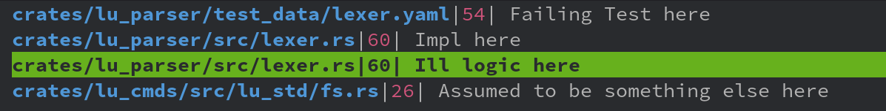

# nvim-locationist

Add your current cursor location to the quickfix list, location list or to the clipboard with ease.



## Installation

```vim
Plug 'LhKipp/nvim-locationist'
```

Don't forget to call setup :smirk:
```lua
require('locationist').setup{}
```

## Usage

The plugin provides one command, the `yank` command.
```lua
 -- Options can be the same as specified in the configuration
 -- Options passed as arguments take precedence over configuration values
require'locationist'.yank({options})

-- Examples

-- Copy the current cursor location to the clipboard
require'locationist'.yank{send_to="clipboard"}
-- Copy the current cursor location to the quickfix list and add an comment
require'locationist'.yank{send_to="clist", comment="default"}
-- Copy the current cursor location to the location list (with the full file path)
require'locationist'.yank{send_to="llist", expand_str="%:p"}
```
The yank command can be used from normal or visual mode.

## Configuration
Values passed via the `setup` command will set the default behaviour of the `yank` command.
```lua
-- Default values are being shown
require'locationist'.setup{
    -- Where the location shall be stored
    --      * clipboard = @+
    --      * clist     = current quickfix list
    --      * llist     = current location list
    send_to = "clipboard",
    -- locationist optionally asks for a comment to store together with the location
    -- set comment to
    --      * "none" to not ask for a comment
    --      * "default" to invoke vim.fn.input to ask for a comment
    --      * your own function. The signature should be `function() -> string`
    --        (If you created a nice func, please share it with us :) )
    comment = "none",
    -- How the file name will be expanded
    expand_str = "%", -- see :h expand for possible values
    -- If indicator is non empty, a character is displayed next to the line number in the llist/clist
    -- Ignored for send_to = "clipboard"
    indicator = '', -- Can be 1 character long string at most!
}
```
